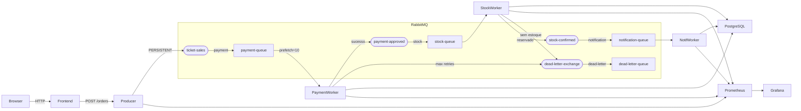

# TicketLab — Sistema Distribuído de Venda de Ingressos

**Disciplina:** Sistemas Distribuídos  
**Tema:** Mensageria assíncrona com RabbitMQ aplicada a venda de ingressos

---

## Objetivo Acadêmico

| Conceito de SD | Onde é demonstrado |
|---|---|
| Fair-loss vs Perfect Links | `delivery_mode=PERSISTENT` + filas durable + ACK manual |
| Best Effort Broadcast | Producer publica sem aguardar confirmação de processamento |
| Reliable Broadcast (aprox.) | Pipeline payment→stock→notification com persistência |
| FIFO por fila | Uma mensagem percorre 3 filas em ordem determinística |
| Crash-stop | `make kill-payment` → mensagens retornam à fila |
| Crash-recovery | `make restart-rabbit` → mensagens persistidas sobrevivem |
| Overbooking / Race condition | `SELECT FOR UPDATE` no stock-worker |
| Idempotência | Verificação de status antes de reprocessar |
| Backpressure | `prefetch_count=10` + `vm_memory_high_watermark` |
| Escalabilidade horizontal | `make scale-workers N=5` |
| Dead Letter Queue | NACK após MAX_RETRIES → DLX → dead-letter-queue |

---

## Arquitetura



### Fluxo de um pedido

```
Browser → POST /orders → Producer cria Order(status=pending) → publica em ticket-sales
  → payment-queue → payment-worker (simula validação cartão, 0.5–2s)
    → [falha] republica com x-retry-count++ → após 3x: NACK → DLQ
    → [sucesso] publica em payment-approved
      → stock-queue → stock-worker (SELECT FOR UPDATE, decrementa estoque)
        → [sem estoque] NACK → DLQ
        → [ok] publica em stock-confirmed
          → notification-queue → notification-worker (gera ticket_code, simula email)
            → Order(status=confirmed, ticket_code=UUID)
```

---

## Início Rápido

```bash
cd ticket-sales-distributed
make setup   # Cria .env a partir de .env.example
make up      # Build + start (~90s na 1ª vez)
```

**Aguarde** todos os healthchecks passarem (`make ps`).

---

## URLs

| Serviço | URL | Login |
|---|---|---|
| Frontend (React) | http://localhost:3000 | — |
| Producer API | http://localhost:8000/docs | — |
| RabbitMQ UI | http://localhost:15672 | admin / admin123 |
| Grafana | http://localhost:3001 | admin / admin123 |
| Prometheus | http://localhost:9090 | — |

---

## Experimentos

```bash
make send-100          # Baseline: 100 pedidos
make send-1000         # Carga: observar filas crescerem
make send-failures     # 30% com falha → DLQ
make kill-payment      # Crash-stop: 1 worker morre
make scale-workers N=5 # Escalabilidade horizontal
make inspect-dlq       # Ver mensagens mortas
make slow-mode         # Workers lentos → fila cresce
make fast-mode         # Workers rápidos → fila drena
make restart-rabbit    # Crash-recovery do broker
```

Sequência completa para apresentação:
```bash
./scripts/run-experiments.sh
```

---

## Análise Acadêmica

### Fair-loss vs Perfect Links
- **Fair-loss (hipotético):** `durable=False` + `delivery_mode=NON_PERSISTENT` → mensagens perdidas no crash do broker
- **Perfect Links (nosso projeto):** exchange e fila durables + `delivery_mode=PERSISTENT` + ACK manual → mensagem gravada em disco antes de qualquer confirmação

### Best Effort Broadcast
O Producer publica e retorna ao cliente sem saber se algum worker processou. Equivalente a "enviar e torcer" — o broker recebeu, mas o processamento é assíncrono e pode falhar.

### Reliable Broadcast (aproximação)
Com persistência + ACK manual, qualquer mensagem que chegou ao broker **será entregue** a algum worker (eventual delivery). Não é Uniform Reliable Broadcast porque um worker pode começar a processar e falhar antes do ACK — a mensagem volta à fila mas o efeito parcial pode ter ocorrido.

### Ordenação FIFO
- **Por fila:** garantida. A `payment-queue` entrega em ordem FIFO para cada consumer individual.
- **Múltiplos workers:** a ordem de processamento global não é preservada. Worker A pode confirmar o pedido 50 antes de Worker B confirmar o pedido 3.

### Falhas suportadas
- **Crash-stop (worker):** RabbitMQ detecta desconexão TCP, mensagens `unacked` voltam para `ready`. Outros workers continuam.
- **Crash-recovery (broker):** mensagens PERSISTENT + fila durable sobrevivem ao reinício. Workers reconectam via `connect_robust`.
- **Overbooking:** `SELECT FOR UPDATE` serializa o decremento de `available_tickets`. Dois workers processando o mesmo evento simultaneamente não causam overbooking.
- **Network partition:** `connect_robust` com backoff exponencial tenta reconectar. Durante a partição, publicações falham com HTTP 503.

---

## Estrutura do Projeto

```
ticket-sales-distributed/
├── apps/
│   ├── frontend/         React 18 + Vite + Tailwind CSS
│   ├── producer/         FastAPI — recebe pedidos e publica no RabbitMQ
│   ├── payment-worker/   Valida pagamento, retry com x-retry-count
│   ├── stock-worker/     Reserva ingressos com SELECT FOR UPDATE
│   └── notification-worker/  Gera ticket_code, simula email
├── config/
│   ├── rabbitmq/         rabbitmq.conf + definitions.json (auto-setup)
│   ├── prometheus/       prometheus.yml
│   └── grafana/          dashboard pré-configurado
├── scripts/
│   ├── setup.sh
│   ├── run-experiments.sh
│   └── cleanup.sh
├── .env.example
├── docker-compose.yml
├── Makefile
└── README.md
```

---

## Problemas Comuns

**Erro de conexão ao subir:**
```bash
make ps  # Aguarde healthchecks (pode levar 60s na 1ª vez)
docker compose logs rabbitmq  # Se rabbitmq demorar, reinicie: make down && make up
```

**Frontend não carrega eventos:**
```bash
curl http://localhost:8000/health  # Producer deve responder "healthy"
```

**Workers não processam:**
```bash
make logs-payment  # Verifique se está conectado ao RabbitMQ
```

**Limpar e recomeçar:**
```bash
make clean && make setup && make up
```
